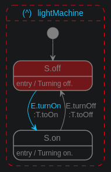
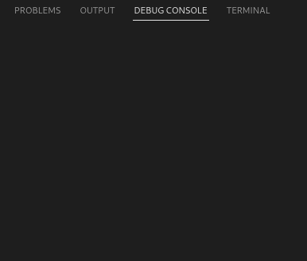
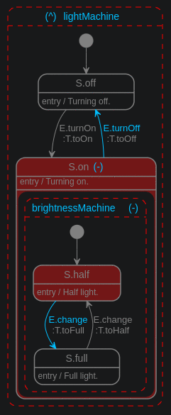
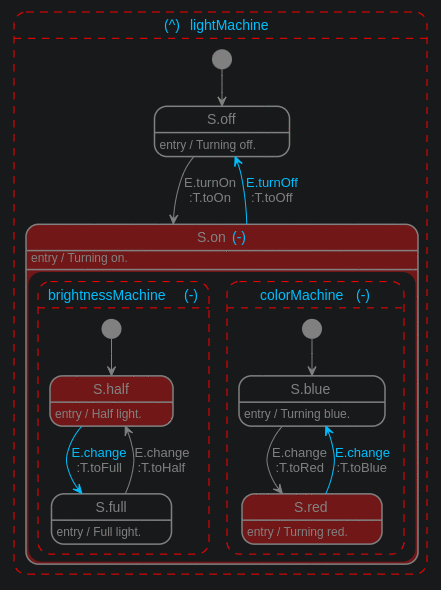
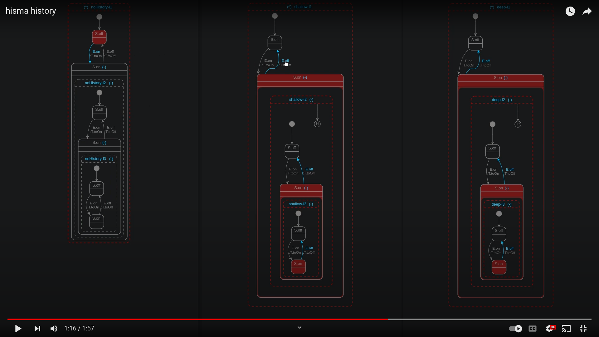

<!--
This README describes the package. If you publish this package to pub.dev,
this README's contents appear on the landing page for your package.

For information about how to write a good package README, see the guide for
[writing package pages](https://dart.dev/guides/libraries/writing-package-pages).

For general information about developing packages, see the Dart guide for
[creating packages](https://dart.dev/guides/libraries/create-library-packages)
and the Flutter guide for
[developing packages and plugins](https://flutter.dev/developing-packages).
-->

# Hisma, a hierarchical state machine.

Hisma provides a declarative hierarchical state machine implementation for [Dart](https://dart.dev/) and [Flutter](https://flutter.dev/) that loosely follows the [UML](https://www.omg.org/spec/UML/) State Machine specification that is in turn based on [Harel's statechart](https://en.wikipedia.org/wiki/State_diagram#Harel_statechart). This is the core package of the hisma packages collection:

| Package on pub.dev                                                      | GitHub                            | Description                                                                                        |
| ----------------------------------------------------------------------- | --------------------------------- | -------------------------------------------------------------------------------------------------- |
| hisma                                                                   | [repo](.)                         | This package. It is the core package of Hisma. You can create hierarchical state machines with it. |
| [hisma_extra](https://pub.dev/packages/hisma_extra)                     | [repo](../hisma_extra/)           | Extra classes on top of Hisma to simplify Hisma usage.                                             |
| [hisma_console_monitor](https://pub.dev/packages/hisma_console_monitor) | [repo](../hisma_console_monitor/) | Monitors state machine status on console.                                                          |
| [hisma_visual_monitor](https://pub.dev/packages/hisma_visual_monitor)   | [repo](../hisma_visual_monitor/)  | Reports state machine status to visma.                                                             |
| [visma](https://pub.dev/packages/visma)                                 | [repo](../visma/)                 | Tool that visualizes state machine status reported by hisma_visual_monitor.                        |
| [hisma_flutter](https://pub.dev/packages/hisma_flutter)                 | [repo](../hisma_flutter/)         | Router generator that turns a state machine into a Flutter routing engine.                         |
| [fb_auth_hisma](https://pub.dev/packages/fb_auth_hisma)                 | [repo](../fb_auth_hisma/)         | Firebase authentication state machine with hisma                                                   |

## Features

See an example Flutter application ([fb_auth_hisma_example](../../examples/fb_auth_hisma_example/)) in action that is using `hisma` state machine defined in [fb_auth_hisma](../fb_auth_hisma/) for the user management workflow, [hisma_flutter](../hisma_flutter/) for Flutter routing based on the state machine and [visma](../visma/) to monitor and visualize the state machine:


### Feature overview

- Basics
  - States
    - OnEntry and OnExit actions
  - Transactions
    - External and internal transitions
    - minInterval check
    - Guards
    - Priority
    - onAction actions
    - onError actions
- Hierarchy
  - Regions
- Connecting state machines through hierarchy
  - EntryPoints and entryConnectors
  - ExitPoints and exitConnectors
- History
  - Shallow history
  - Deep history
- Monitoring
  - Console monitor
  - Visual monitor

## Getting started

You can start using the package without prerequisites.

## Usage

### Minimalist state machine declaration

Let's try first the smallest step possible: Create a state machine that has only its name defined.

> **_NOTE:_** If you try using this minimalist state machine in debug mode you will fail on some asserts. It is only presented here to demonstrate the minimal state machine declaration possible.

```dart
final machine = StateMachine(
  name: 'minimal',
  initialStateId: null,
  states: {},
  transitions: {},
);
```

This is for no other use than show you how it will be visualized if you use the hisma_visual_monitor. The dashed line means that it is a state machine:


### Light machine

Let's create something more useful than our previous example: a light machine. This (rather typical) state machine example declares a machine with two states: `on` and `off` and user will be able to switch between these states with the `turnOn` and `turnOff` events.

First create enums that represent states, events and transitions

```dart
enum S { on, off }

enum E { turnOn, turnOff }

enum T { toOn, toOff }
```

It is best practice to use enums to define these.
Next we define a function that create a machine for us (we will use this function later to create more complex hierarchical state machines) and then use this function to create our lightMachine:

```dart
StateMachine<S, E, T> createLightMachine({
  RegionList<S, E, T>? regions,
}) =>
    StateMachine<S, E, T>(
      name: 'lightMachine',
      events: E.values,
      initialStateId: S.off,
      states: {
        S.off: State(
          etm: {
            E.turnOn: [T.toOn],
          },
          onEntry: Action(
            description: 'Turning off.',
            action: (machine, arg) async => print('OFF'),
          ),
        ),
        S.on: State(
          etm: {
            E.turnOff: [T.toOff],
          },
          regions: regions,
          onEntry: Action(
            description: 'Turning on.',
            action: (machine, arg) async => print('ON'),
          ),
        ),
      },
      transitions: {
        T.toOn: Transition(to: S.on),
        T.toOff: Transition(to: S.off),
      },
    );

final lightMachine = createLightMachine();
```

StateMachine includes two very important attributes: `states` and `transitions`. Both are maps from their id to the actual state or transition objects. Inside a State we see the event to transition map (`etm`) that as name suggest defines which transition to execute if a certain event occurs. Since not one but a list of transitions are defined for a certain event, one transition will be selected based on the minInterval, guard and priority attributes of these transitions.

Also note, that states and transitions can have Action attributes. A State can have onEntry and onExit Action attributes while a transition can have an onAction Action attribute. In our example as we saw we used the onEntry Actions to print out the state name our machine just entered.

If we start this machine it will be visualized by `visma` as



We see that we have one machine and its name is lightMachine. The machine is active as indicated by the red dashed line of the state machine. We see the active state is S.off (indicated by its red color) and that E.turnOn event is valid (indicated by the light blue event name) from this state (that leads us to the S.on state). In the visma user interface in the web browser you can click on this event to trigger it.

Now let's create a play function to play around with our newly created state machine. It will turn on and off the machine with one sec interval between operations:

```dart
Future<void> play() async {
  while (true) {
    await Future<void>.delayed(const Duration(seconds: 1));
    await lightMachine.fire(E.turnOn);
    await Future<void>.delayed(const Duration(seconds: 1));
    await lightMachine.fire(E.turnOff);
  }
}
```

and finally the main function where we start the machine and invoke our play function. Also we init here StateMachine.monitorCreators with a creator function of VisualMonitor (doing the communication with [visma](../visma/), our state machine visualizer server):

```dart
Future<void> main() async {
  StateMachine.monitorCreators = [
    (machine) => VisualMonitor(machine),
  ];

  await lightMachine.start();
  play();
}
```

This is what you get on the console as a result of the Actions defined for the state entries (onEntry):


This is the what you see in visma (in the web browser):


### More on transitions

#### External transitions

As we see transitions take us from one state to another state. However, it is also possible to start and end a transition in the same state. When transition occurs, the respective onExit and onEntry activities are executed as machine leaves the source and enters the target state (even if the source and target state machine is the same). UML specification refers to these transitions as external transitions.

Let's define an external transition with all its optional attributes also included:

```dart
T.toStop: Transition(
  to: S.stop,
  minInterval: const Duration(seconds: 1),
  guard: Guard(
    description: 'If not empty.',
    condition: (machine, arg) async => true,
  ),
  priority: 10,
  onAction: Action(
    description: 'Closing.',
    action: (machine, arg) async => print('Closing'),
  ),
  onError: OnErrorAction(
    description: 'Print error message.',
    action: (machine, onErrorData) async => print(onErrorData.message),
  ),
),
```

When an this transition is visualized in [visma](../visma/) it is rendered as an arc with a label:


This label includes all attributes of the transition we defined above:

- Mandatory items
  - **Event Identifier**<br>
    Clickable to trigger the event in the machine when corresponding state is active. This is for debugging purposes.
  - **Transition Identifier**<br>
    Transition id as it is in the transition map of the state machine.
- Optional items (In our example they are defined, but they are optional attributes.)
  - **minInterval**<br>
    Minimum Duration that shall passed from last time this transition happened. If interval is shorter then a HismaIntervalException is thrown if onError is not defined. If onError is defined then its action will be called and no exception is thrown.
  - **Guard description**<br>
    Description of [Guard] whose action must return `true` to execute transition. If returned value
    is false then a HismaGuardException is thrown if onError is not defined. If onError is defined then its action will be called and no exception is thrown.
  - **Priority**<br>
    If not otherwise selected priority can be used to select the transition from the transition list by this priority.
  - **onAction Action description**<br>
    Description of the Action that is executed when this transition occurs.
  - **onError OnErrorAction description**<br>
    Description of the OnErrorAction that is executed when minInterval or Guard blocked execution of this transition. In the label his section is in the same line as the onAction description and the two are divided by the `||` sign.

#### Internal transitions

In many cases in response to an event you do not want to change state, even further you do not want onExit and onEntry actions to be executed: you simple want an action to be executed. For such cases one can use an [InternalTransition].

```dart
T.timedOn: InternalTransition(
  onAction: Action(
    description: 'Turn on in 3 sec.',
    action: (machine, arg) async {
      print('Initiating timer to turn on in 3 sec.');
      await Future.delayed(
        const Duration(seconds: 3),
        () {
          print('Fire timedOn.');
          machine.fire(E.turnOn);
        },
      );
    },
  ),
),
```

When this internal transition is visualized by [visma](../visma/) it looks like:


As seen, label shows the same information just like for external transitions we reviewed above with the slight differences of having a `=` sign after the transition id and that it is in one line versus the multiline rendering of the external transition label.

The only difference compared to definition of an external transition that it does not include the `to` parameter as internal transition is only about executing an Action and not about changing states. All other attributes that we learned for external transitions - minInterval, Guard, priority, onAction, onError - has the same meaning for internal transitions as well.

#### Extend lightMachine with internal transitions

Let's extend our previous lightMachine example the following ways:

- Add all optional attributes of the T.toStop external transition as we saw above.
- Add internal transitions that when executed will set a timer to change the machine to the other state.

See the complete example in [01_simple.dart](example/01_simple.dart). When the updated lightMachine is rendered by [visma](../visma/) it looks like:


### Compound state machine - single region

In our next example we build a simple compound state machine where the parent machine will include a single child machine (a region). Practically this is our first hierarchical state machine. Hierarchical state machines gives us the power of abstraction and reusability:

- Abstraction, as we can capture the high level essence of our operation at higher levels while detailing out behavior at lower level state machines.
- Reusability, as you can create a state machine that will be reused in different high level state machines.

We will rely on our lightMachine from the first example as the parent machine and we will create a new machine that will add extra functionality to it: setting the brightness of the light to `half` or `full`.

First, again, we define our states, events and transitions as enums for this new brightness machine:

```dart
enum S { half, full }

enum E { change }

enum T { toHalf, toFull }
```

Next we define the machine (again with he help of a creator function that will be used in later examples):

```dart
const brightnessMachineName = 'brightnessMachine';

StateMachine<S, E, T> createBrightnessMachine({
  RegionList<S, E, T>? regions,
}) =>
    StateMachine<S, E, T>(
      name: brightnessMachineName,
      events: E.values,
      initialStateId: S.half,
      states: {
        S.half: State(
          etm: {
            E.change: [T.toFull],
          },
          onEntry: Action(
            description: 'Half light.',
            action: (machine, arg) async => print('HALF'),
          ),
        ),
        S.full: State(
          etm: {
            E.change: [T.toHalf],
          },
          onEntry: Action(
            description: 'Full light.',
            action: (machine, arg) async => print('FULL'),
          ),
        ),
      },
      transitions: {
        T.toFull: Transition(to: S.full),
        T.toHalf: Transition(to: S.half),
      },
    );
```

Next step is the new thing, we will add this new machine to a region of one state inside the parent lightMachine. State has the regions attribute that allows us declaring the list of regions where each Region has one machine, and as we will see in a later example, and connectors to this machine.

```dart
State(regions: [Region(machine: machine)])
```

Here we rely on the lightMachine example where the creator function optionally receives a Region list:

```dart
final lightMachine = lm.createLightMachine(
  regions: [Region(machine: createBrightnessMachine())],
);
```

Let's create next our play function to get this new two layer hierarchical state machine working for us:

```dart
Future<void> play() async {
  while (true) {
    await Future<void>.delayed(const Duration(seconds: 1));
    await lightMachine.fire(lm.E.turnOn);

    for (var i = 0; i < 5; i++) {
      await Future<void>.delayed(const Duration(seconds: 1));
      await lightMachine.find<S, E, T>(brightnessMachineName).fire(E.change);
      await Future<void>.delayed(const Duration(seconds: 1));
      await lightMachine.find<S, E, T>(brightnessMachineName).fire(E.change);
    }

    await Future<void>.delayed(const Duration(seconds: 1));
    await lightMachine.fire(lm.E.turnOff);
  }
}
```

The main functions is exactly the same as in previous cases with the registration of the VisualMonitor:

```dart
Future<void> main() async {
  StateMachine.monitorCreators = [
    (machine) => VisualMonitor(machine),
  ];

  await lightMachine.start();
  play();
}
```

If we run this example this is what we see in the console:



and this is what we see in the visual monitor, visma in the web browser (if we open both the `S.on` state and the enclosed `brightnessMachine` inside its only region in the interactive state machine diagram rendered by visma):



### Compound state machine - multiple regions

As we see in the example [03_compound_multiple_regions.dart](example/03_compound_multiple_regions.dart) it is easy to add multiple regions to the same state. These regions can be also referred as concurrent regions since they (or better to say the state machines corresponding to them) can all be active at the same time. The play function of this example is operating all three machines: the top level lightMachine and the machines in the regions of the `S.on` state:



Let's summarize what we achieved so far:

- We created a simple hierarchical state machine
- where inside one of the states (`S.on`) of the **parent state machine** we declared two concurrent **regions** with their corresponding (child) state machines (brightnessMachine and colorMachine).
- During operation when the `E.turnOn` event fired it results the `T.toOn` transition that in turn results changing the active state of the state machine to `S.on`.
- As a consequence regions of the `S.on` state are also activated: their initial state (defined by their initialStateId) will be activated.

### Entry and exit points

What if, in certain cases, instead of activating the state defined by the initialStateId of these machines, we want another state to be activated? Also, what if, from inside these machines, we want some events to trigger events in the parent machine? Entry and exit points are there to help with these use cases. We optionally declare them for the Region as mappings between the parent and the child machines as we will see them in detail.

> **Note**
> Entry and exit points can also be viewed as the **interface** for the state machine
> as they can be connected to triggers and event in the parent machine.

#### Entry connector and EntryPoint

Entry connector mapping define that for a certain trigger (defined as source state id, transition id and event id trio of the parent state machine) which EntryPoint (that is a also a kind of state: an entry point pseudo state) in the state machine of the region (child machine) needs to be used.
When this EntryPoint is selected the child state machine will be in this state momentarily to select the transition to be used from a defined list of Transition objects of the EntryPoint.

When we design our state machine we define these Transition objects in the constructor of the EntryPoint objects. These Transition objects then can take the machine to

- a regular state
  - which in turn can also be used to map to an EntryPoint of a Region of this state
    (its child) if this is what we want.
- an ExitPoint
- a Final State

For example if we want the `T.toB` Transition to be used if our entry point is activated we define it like this:

```dart
EntryPoint([T.toB]),
```

Optionally you can give multiple transitions in the list and in that case the same transition selection process is in place that [we learned earlier](#light-machine) for the regular State:

```dart
EntryPoint([T.toB, T.toC]),
```

Later when we integrate this (child) state machine into a (parent) state machine we can define that what Trigger in the parent machine is triggering activation of this entry point we defined in the child state machine. We do this inside the `entryConnectors` attribute of the Region enclosing our child machine:

```dart
Region(
  machine: childMachine,
  entryConnectors: {
    Trigger(source: SP.first, event: EP.e1, transition: TP.toSecond): SC.ep1,
  },
),
```

where SP, EP and TP are defined for the parent state machine and SC is defined for the child state machine.

> **Note**
> Currently all three of the Trigger must be defined. In future versions it might be optional to define all three.

#### Exit connector and ExitPoint

Exit connector mapping define that when a certain ExitPoint reached in the child machine what event shall be triggered in the parent machine.

It is simply defined without any arguments to its constructor:

```dart
ExitPoint(),
```

Later when we integrate this (child) state machine into a (parent) state machine we can define that when child machine reaches this exit point which event shall be triggered in the parent machine:

```dart
Region(
  machine: childMachine,
  exitConnectors: {SC.exit: EP.turnOff},
),
```

where `SC.exit` is an ExitPoint in the child machine and `EP.turnOff` is an event in the parent machine.

#### EntryPoint, ExitPoint example

Let's create a new machine that will "power" our lightMachine: the powerMachine. This new machine has two states:

- `S.grid` indicating that the power is coming from the grid.
- `S.battery` indicating that we are on battery power.

The power machine can alter between these states on the `E.change` event, but even more importantly for our example, it is also prepared for customized integration into a parent state machine:

- `E.epGrid` and `E.epBattery` entry points are defined to let parent explicitly define how the powerMachine shall be started: in grid or in battery mode.
- `E.exDown` exit point let parent machine to manage the power down situation in the parent machine: moving the parent state machine to the `LMS.off` state.

First have a look how our powerMachine is declared:

```dart
enum S { epGrid, epBattery, grid, battery, exDown }

enum E { change, down }

enum T { toGrid, toBattery, toDown }

const powerMachineName = 'powerMachine';

StateMachine<S, E, T> createPowerMachine() => StateMachine<S, E, T>(
      name: powerMachineName,
      events: E.values,
      initialStateId: S.grid,
      states: {
        S.epGrid: EntryPoint([T.toGrid]),
        S.epBattery: EntryPoint([T.toBattery]),
        S.exDown: ExitPoint(),
        S.grid: State(
          etm: {
            E.change: [T.toBattery],
            E.down: [T.toDown],
          },
          onEntry: Action(
            description: 'Switching to grid.',
            action: (machine, arg) async => print('GRID'),
          ),
        ),
        S.battery: State(
          etm: {
            E.change: [T.toGrid],
            E.down: [T.toDown],
          },
          onEntry: Action(
            description: 'Switching to battery.',
            action: (machine, arg) async => print('BATTERY'),
          ),
        ),
      },
      transitions: {
        T.toBattery: Transition(to: S.battery, priority: 100),
        T.toGrid: Transition(to: S.grid),
        T.toDown: Transition(to: S.exDown),
      },
    );
```

Since we want to control the start of this new power machine directly from the lightMachine we need to declare it accordingly (extra events compared to our [01_simple.dart](example/01_simple.dart) example):

```dart
enum LMS { on, off }

enum LME { turnOnGrid, turnOff, turnOnBattery }

enum LMT { toOn, toOff }

StateMachine<LMS, LME, LMT> createLightMachine({
  RegionList<LMS, LME, LMT>? regions,
}) =>
    StateMachine<LMS, LME, LMT>(
      name: 'lightMachine',
      events: LME.values,
      initialStateId: LMS.off,
      states: {
        LMS.off: State(
          etm: {
            LME.turnOnGrid: [LMT.toOn],
            LME.turnOnBattery: [LMT.toOn],
          },
          onEntry: Action(
            description: 'Turning off.',
            action: (machine, arg) async => print('OFF'),
          ),
        ),
        LMS.on: State(
          etm: {
            LME.turnOff: [LMT.toOff],
          },
          regions: regions,
          onEntry: Action(
            description: 'Turning on.',
            action: (machine, arg) async => print('ON'),
          ),
        ),
      },
      transitions: {
        LMT.toOn: Transition(to: LMS.on),
        LMT.toOff: Transition(to: LMS.off),
      },
    );
```

As next step let's create our lightMachine with a region that has out powerMachine in it with the required entry and exit connection mappings:

```dart
final lightMachine = createLightMachine(
  regions: [
    Region(
      machine: createPowerMachine(),
      entryConnectors: {
        Trigger(
          source: LMS.off,
          event: LME.turnOnGrid,
          transition: LMT.toOn,
        ): S.epGrid,
        Trigger(
          source: LMS.off,
          event: LME.turnOnBattery,
          transition: LMT.toOn,
        ): S.epBattery,
      },
      exitConnectors: {S.exDown: LME.turnOff},
    ),
  ],
);
```

If we monitor this lightMachine we just have created in `visma` it looks similar to the image bellow. Pay attention to that our

- Entry connector definitions are indicated with an empty square on the state that has the region inside.
- Round icons are indicating the entry points to the child machine.
- Exit connector definitions are indicated with filled squares on on the state that has the region inside.
- Round icon with X in it indicates the exit point of the child machine
- Yellow curves are indicating the entry and exit connectors that are mapping between
  - parent Triggers and child entry points
  - child exit points and parent events


Complete example can be found in [04_entry_and_exit_points.dart](example/04_entry_and_exit_points.dart). Check it out and play around with your machines either from code or from the `visma` ui.

### History

Let's imagine a three layered hierarchical state machine: l1, l2 and l3. Each machine has an `off` and an `on` state and the initial state is `off` for all three machines. It is always the `on` state that incorporates the lower (l3 is lower than l2 is lower than l1) layer state machine.

The [05_history.dart](example/05_history.dart) example declares such a state machine and it is named as `noHistory-l1`. If we visualize it with `visma` it looks like this:


Let's assume we active all three `S.on` states in the three state machines. Now inside the top level machine we change back to `S.off`. This will result stopping l2 and l3 machines. Then we change back l1 machine again to `S.on`. The enclosed l2 and l3 machines will be initialized by their initialStateId to `S.off`. This is the default behavior.

We can change this and set the starting machines active states based on their history (the last active state they had been in before they were stopped).

There are two types of history that we can set for a state machine:

- shallow history, indicated as `(H)` on diagrams
- deep history, indicated as `(H*)` on diagrams

In case of shallow history defined only the state machine where this shallow history is defined will come back to its last active state when started, its child state machine hierarchy will be initialized by the default way: based on their initialStateId.

In case of deep history defined the state machine where the deep history is defined and its complete child state machine hierarchy will be initialized based on their respective last active states.

In the image bellow you see side by side the three hierarchical state machines defined in the [05_history.dart](example/05_history.dart) example:

- noHistory-l1 - no history is set for the enclosed noHistory-l2 machine
- shallow-l1 -shallow history is set for the enclosed shallow-l2 machine
- deep-l1 - deep history is set for the enclosed deep-l2 machine

The l1 machines were just **returned** to the `S.on` states - check the differences in the active state of the l2 and l3 machine:


You can also watch a short video about executing the above described sequence in these three different machines side-by-side:

[](https://youtu.be/f17P9PbJ6UI?cc_load_policy=1)

## Additional information

### Disclaimer

As the package version indicates this is an experimental package, not ready for prime use. API changes are expected and test coverage is low.

### Next steps

- Finalize API.
- Increase test coverage.
- Improve documentation.
- More helper classes in hisma_extra.

### Help needed

- Feedback, especially about things you would like to change.
- Finding bugs either in code or in documentation are always welcomed.
  - Providing a failing test to demonstrate the bug is even better.
- Creating tests.
- Creating documentation.

### Contact

If you have any questions, comments please go to [Hisma GitHub Discussions](https://github.com/tamas-p/hisma/discussions) to start or join discussions.
