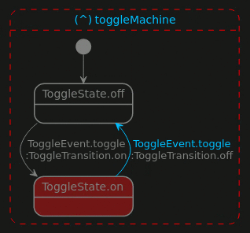

<!--
This README describes the package. If you publish this package to pub.dev,
this README's contents appear on the landing page for your package.

For information about how to write a good package README, see the guide for
[writing package pages](https://dart.dev/guides/libraries/writing-package-pages).

For general information about developing packages, see the Dart guide for
[creating packages](https://dart.dev/guides/libraries/create-library-packages)
and the Flutter guide for
[developing packages and plugins](https://flutter.dev/developing-packages).
-->

Extra classes on top of Hisma to simplify Hisma usage.

This package intended to contain all classes that is built on top of [hisma](../hisma/) in order to simplify its usage.

## Features

- toggle state machine ([ToggleStateMachine])



## Getting started

Install [hisma](../hisma/), hisma_extra and optionally any monitors (e.g. [hisma_console_monitor](../hisma_console_monitor/) or [hisma_visual_monitor](../hisma_visual_monitor/)).

## Usage

Currently the single extra that is available for Hisma is the [ToggleStateMachine] class that creates a simle two states (`on` and `off`) state machine.

Create the machine:

```dart
final machine = ToggleStateMachine(name: 'toggleMachine');
```

Use the machine:

```dart
Future<void> play() async {
  while (true) {
    await Future<void>.delayed(const Duration(seconds: 1));
    await machine.toggle();
  }
}
```

## Additional information

If you have any questions, comments please go to [Hisma GitHub Discussions](https://github.com/tamas-p/hisma/discussions) to start or join discussions.
